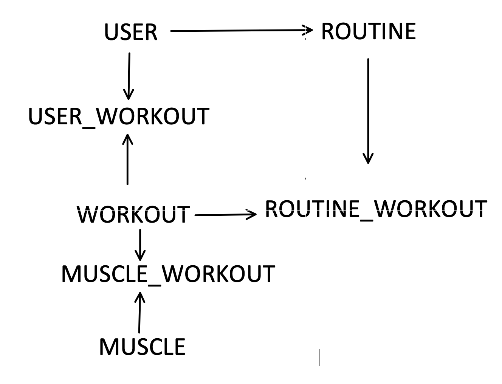

# work_it_out
Work It Out is an app for tracking workout routines. 

## Background 

Work It Out was created for my Mod 3 project for Flatiron school as a way to showcase my understanding of functional programming with Javascript. We were given the option of using functional or object oriented programming, and because I have experience with object oriented programming in Javascript and Ruby I decided to challenge myself by creating an app using functional programming. 

Work It Out is meant to help the user find workouts for specific muscles, as well as track their own routines (collections of workouts). Work It Out was born out of my own problem of being bored at the gym, having done the same kinds of workouts over and over again. I wanted a method to quickly find a new workout for a specific muscle, and a way to incorporate that into my routine for the day. 

## Functionality 

With Work It Out, the user can: 

- Create an account 

- See a list of their routines ordered chronologically 

- Create a new routine from scratch, selecting from a list of workouts available to populate the routine's workout list 

- Create new workouts 

- Copy existing routine's data into the new routines fields, allowing them to replicate old routines without interruption

- Delete old routines

## Model Wireframes 

The arrows in the image below represent "has many" relationships (as in, the User model has many user_workouts, and has many workouts through user_workouts). 



## Tools and Technologies 

-  [Ruby on Rails 6](https://rubyonrails.org/)

-  [Faker](https://github.com/faker-ruby/faker)

-  Javascript, HTML, CSS 

- [Semantic UI 2.4](https://semantic-ui.com/)

## Installation 

```
# clone this repo

git clone git@github.com:tylergreason/work_it_out.git work_it_out

# cd into the backend directory

cd work_it_out/workout_backed

# bundle/install the necessary gems 

bundle install

# migrate the database 

rails db:migrate

# seed the database 

rails db:seed

# start a rails server

rails s

# in another terminal, navigate to the workout_frontend folder 

cd (the directory work_it_out is in)/work_it_out/workout_frontend

# open the index.html file to view the site's contents 

open index.html 

```

From here, enter any username. You will be taken to the main page from which you can make new routines, new workouts, and view your (not yet made) routines. 


## Usage 

## Challenges and What I Learned 
