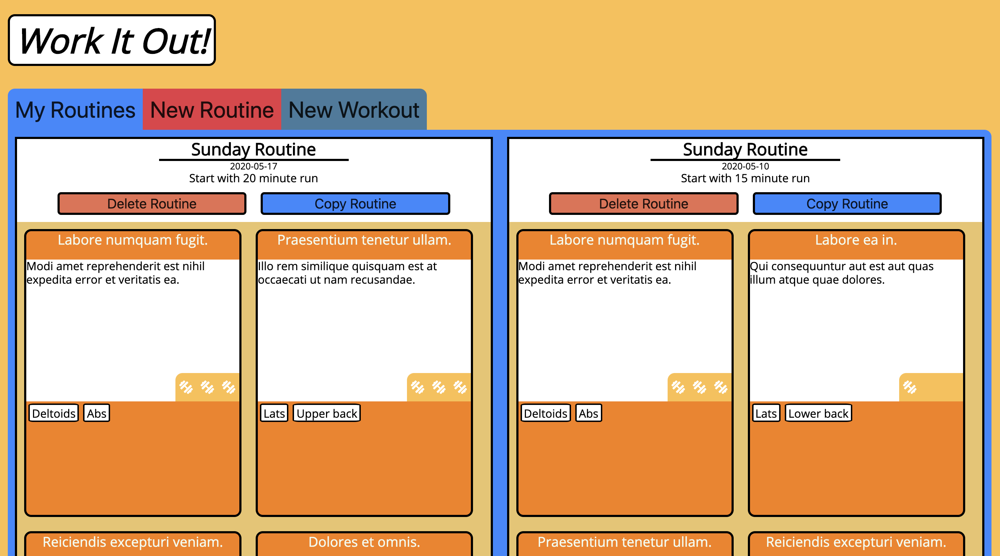
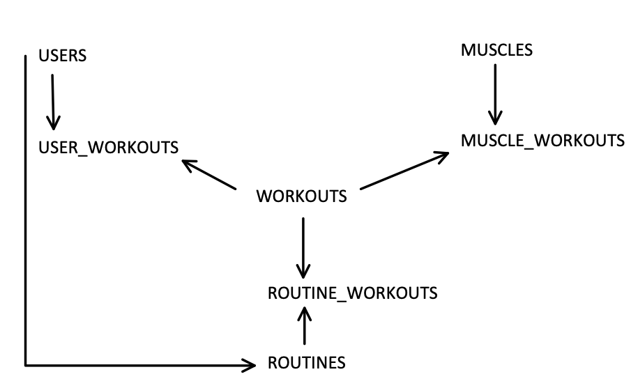

# Work It Out
_A single page application to make tracking workout routines easy._

## Background
Work It Out was made for my third project for Flatiron School’s Immersive Software Engineering program. The goal of this project was to show our understanding of JavaScript by writing a single page application using functional or object oriented programming. I had the least experience with functional programming and decided to challenge myself by using functional programming to develop my application. 

I wanted to build an application to track workouts and workout routines because I wanted an application that allowed me to easily copy old workout routines into a new field, make small edits, and create a new instance of that workout routine. I love to work out and do so weekly. I usually repeat workout routines each week with small variations, so the ability to quickly make copies of and edits to old workout routines seemed exciting and a great way to show my functional programming knowledge. 

## Functionality
Users can:
- Log in to a new or existing account.
- View their workout routines, ordered by date. 
- Delete workout routines. 
- Make new workout routines by using a form that includes the name of the workout routine, a description, the date of the routine, and a selection of workouts that comprise the workout routine. 
- Copy existing workout routine data into the new workout routine field with the click of a button, allowing for easily editing old workout routines quickly and making new instances of them. 
- Create new workouts including a name, description, difficulty rating, and selection of muscles that the workout targets. 
- View all workouts by their muscle groups. 

## Tools and Technologies

Frontend Technologies:
- HTML, CSS, Javascript
- [SASS](https://sass-lang.com/) - Used to decrease development time using SASS’s mixins and syntax, which I believe makes writing CSS leagues faster and is more readable. 
- [BEM (Block Element Modifier)](http://getbem.com/) - I wanted the CSS for this application to be easily understood by anyone who might read it but did not want to invent my own naming system for ensuring this. I found BEM and decided to implement it when I refactored the CSS for this application because its naming scheme is very easy to understand. 
- [Font Awesome](https://fontawesome.com/) - I used Font Awesome for their barbell icon, which is used to represent how difficult a workout is. 
- [Google Fonts](https://fonts.google.com/specimen/Open+Sans?selection.family=Open+Sans&sidebar.open) - I used the font Open Sans from Google Fonts for all the application’s text. 

Backend Technologies:
- [Ruby 2.6](https://www.ruby-lang.org/en/), [Ruby on Rails 6.0.2.2](https://rubyonrails.org/) - Used to create the model and controller portions of the MVC. 
- [Faker](https://github.com/faker-ruby/faker.git) - Used to quickly create fake data for testing.

## Usage

Users can perform three main actions: view their workout routines, create a new workout routine, or create a new workout. 

 
When a user logs in they see all of their workout routines in order by date. 
Users can copy a workout routine’s data to the new routine form: 
 

Here, the user changed the duration by which they run, and swapped one workout for another. This makes repeating old workouts quick and easy. 
 
Users can also create new workouts:
 

 
Workouts the user creates can be added to future new workout routines. 

## Wireframes 

 

The arrows in the diagram above represent which models have a ‘has many’ relationship to the model the arrow points at. The joining tables, user_workouts, muscle_workouts, and routine_workouts each belong to the models they join. Routine belongs to user, because each routine has only one user. 

## Challenges and What I Learned

k It Out taught me the importance of not stuffing functions with too much functionality. I learned that functions should be slim, readable, and multi-purposed if possible. I also learned that if you have the slightest inkling of a feeling that you will need to do any given process more than once, write a function for it! It may take a moment longer to write, but it will save you time in the long run. 

I also learned the importance of separating files by functionality. An application of this size would be a nightmare to read if it were all in one file. Separating files by functionality makes the application easier to read for yourself and others, and when you need to find a specific function you know exactly where it is. 

I learned how important it is to use a sensible naming structure for CSS classes and IDs. When I refactored the CSS for Work It Out I began using the BEM methodology for naming elements and their classes and IDs. I refactored some (not all) of the old elements to use BEM methodology, and utilized it for all new elements. This made writing CSS for Work It Out so easy that I didn’t even have to look at my JavaScript to find what I named an element’s class or ID; I could simply remember that lists of muscles inside workout cards had the class ‘workout__muscles’, and the muscles inside those lists had the class ‘workout__muscle’. 
## Next Steps

- Add functionality to add new muscle groups. 
- Let users delete their workouts. 
- Optimize for mobile for use on the go. 
- Add quantity and set fields for workouts in workout routines so users know how many of a workout they did. 
- Refactor workout selection in the new routine form to use a field of selectable muscles to filter which workouts include those muscles. 

